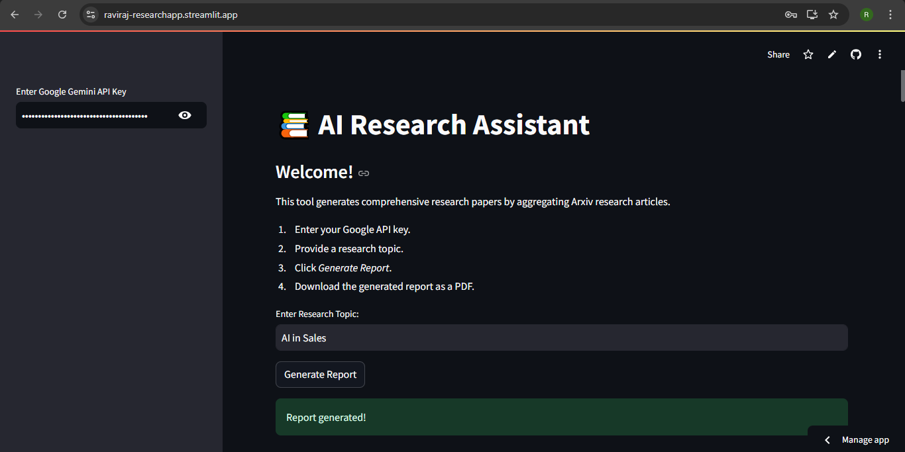

# AI Research Assistant

The AI Research Assistant is a Streamlit-based application that leverages Google Generative AI and LangChain to generate comprehensive research reports. By aggregating and summarizing research documents from arXiv, the app produces detailed research papers—including literature reviews, findings, statistics, and APA citations—with a single click. Users can also download the generated report as a PDF.

---



---

## Table of Contents

- [Overview](#overview)
- [Features](#features)
- [Installation](#installation)
- [Usage](#usage)
- [Dependencies](#dependencies)
- [Acknowledgments](#acknowledgments)

---

## Overview

The AI Research Assistant streamlines the research process by:
- Generating tailored Google search queries for a given research topic.
- Retrieving and summarizing arXiv research articles.
- Collating summaries, paper titles, and URLs.
- Composing a detailed research report (with a minimum of 1,200 words) using a custom writer prompt.
- Converting the final report into a downloadable PDF.

The app is designed for researchers and academicians who want to automate the generation of literature reviews and research papers.

---

## Features

- **Dynamic Research Query Generation:** Uses LangChain's prompt templates to create targeted Google search queries.
- **ArXiv Document Retrieval & Summarization:** Retrieves up to 10 relevant arXiv documents and summarizes them using a combination of LLM and output parsing.
- **Comprehensive Report Writing:** Combines multiple chains (search query, web search, and summarization) to produce a detailed research paper including literature review, findings, statistics, and APA citations.
- **PDF Report Generation:** Converts the generated report into a PDF with proper formatting using FPDF.
- **User-Friendly Interface:** Built with Streamlit for a clean and intuitive experience. Users provide a Google API key and research topic to generate their report.

---

## Installation

### Prerequisites

- Python 3.8 or higher
- A valid Google Generative AI API key

### Steps

1. **Clone the Repository:**

   ```bash
   git clone https://github.com/RavirajGaikar/Research_App.git
   cd Research_App
   ```
2. **Create and Activate a Virtual Environment:**

   ```bash
   python -m venv env
   env\Scripts\activate
   ```
3. **Install Required Packages:**

   ```bash
   pip install -r requirements.txt
    ```
---

## Usage

### Launch the App:

Run the following command in your terminal:
```bash
streamlit run research_app.py 
  ```

### Set Up:

1. Enter your Google Gemini API key in the sidebar.

2. Provide a research topic in the main input field.

3. Click on Generate Report.

### Interact & Download:

- Once the report is generated, it will be displayed on the page.

- Use the **Download PDF** button to save the report as a PDF.

---

## Dependencies:

- streamlit
- fpdf2
- langchain
- langchain-community
- langchain_google_genai
- arxiv

---

## Acknowledgments: 

- Build by [Raviraj Gaikar](https://www.linkedin.com/in/raviraj-gaikar-05a986212/)

- Built using Streamlit for the interactive web interface.

- Powered by Google Generative AI and the LangChain framework.


Feel free to contribute, open issues, or submit pull requests to improve the project. Enjoy exploring and automating your research process!

